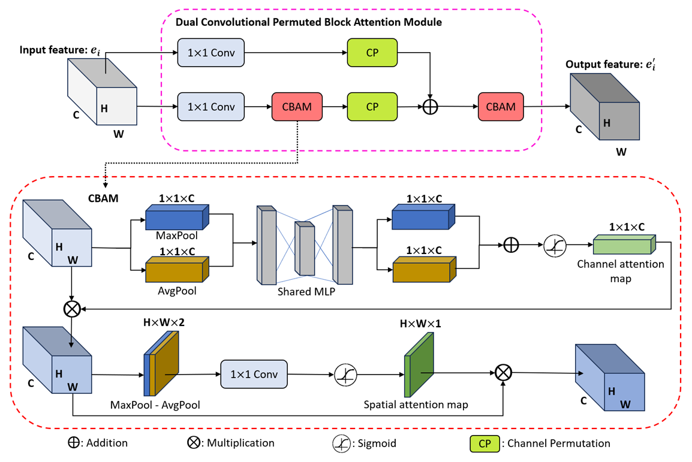
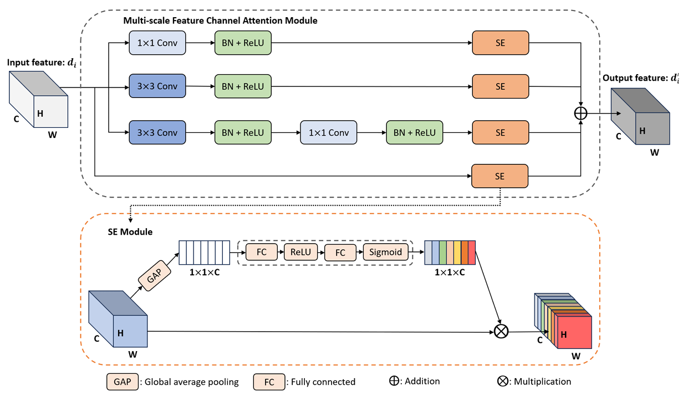

# An efficient dermatological lesion diagnosis method based on U-shape architecture

**Abstract**: The diagnosis of skin cancer remains a challenging task due to the high visual similarity among various types of skin lesions. Early detection and accurate diagnosis can significantly improve treatment outcomes. In this study, we propose a lightweight deep learning model based on the U-shape architecture, which leverages lesion segmentation information to enhance the performance of skin lesion diagnosis. To ensure efficient information retention and selection during inference, two novel attention modules have been proposed in the model without significantly increasing the number of trainable parameters. Moreover, we introduce four training strategies designed to exploit the relationship between lesion localization and lesion type classification. To assess the performance of our proposed method, we performed a series of thorough experiments using three benchmark datasets: ISIC2016, ISIC2017, and PH2. The results indicate that our method matches or exceeds the performance of several state-of-the-art approaches, despite relying on significantly fewer parameters and not requiring any supplementary data. These findings suggest that segmentation knowledge can be effectively utilized to improve skin lesion diagnosis in a lightweight and efficient manner, highlighting its potential for integration into real-time and resource-constrained medical diagnostic systems.

## Model architecture:


###  Dual Convolutional Permuted Block Attention Module



###  Multi-scale Feature Channel Attention Module



## Data


Download the datasets from the corresponding links below and place them in the `data/` folder.


ISIC2016: https://challenge.isic-archive.com/landing/2016/

ISIC2017: https://challenge.isic-archive.com/landing/2017/

PH2: https://www.fc.up.pt/addi/ph2%20database.html

Process the data using the `.ipynb` files corresponding to each dataset. The processed data will be in `.npy` format and must be placed in the `loaded_data/` folder. Note that our program is designed to run on processed data.


## Project Structure

```plaintext
main_folder/
├── __pycache__/                # Compiled Python files
├── data/                       # Raw data directory
├── loaded_data/                # Preprocessed data
├── image/                      # Image folder
├── model/                      # Model architecture and modules
│   ├── __pycache__/
│   ├── DCPBAM.py               # DCPBAM attention module
│   ├── encoderModel.py         # Encoder only model
│   ├── fullModel.py            # Full model combining components
│   └── MFCAM.py                # MFCAM attention module
├── process_data/               # Data preprocessing notebooks
│   ├── processData_ISIC2016.ipynb
│   ├── processData_ISIC2017.ipynb
│   └── processData_PH2.ipynb
├── loss.py                     # Loss function definitions
├── main.py                     # Main script
├── README.md                   # Project documentation
└── requirements.txt            # Python dependencies
```

## Run

```code
python -m ./main.py
```